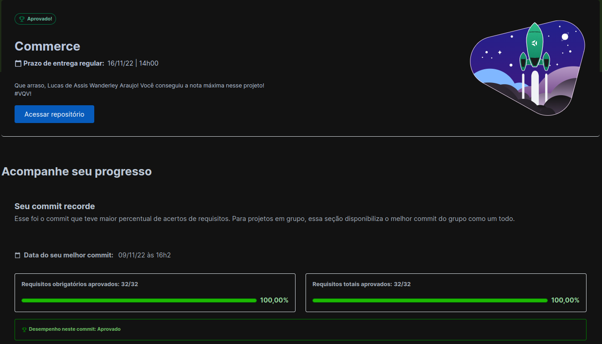

# Commerce - MongoDB #

## About | Sobre

  
<strong>:us: English</strong>
 
  Sorry, this content is currently unavailable! :worried:
   

 
<strong>:brazil: Português</strong>
 
  Projeto em MongoDB desenvolvido como finalização do Bloco 29 do Módulo de Desenvolvimento Backend do curso de Desenvolvimento Web da Trybe.

  Foram dispostos 32 desafios a serem superados com a utilização de comandos MQL (MongoDB Query Language) para a criação e manipulação de um banco de dados em MongoDB.

  Projeto desenvolvido por: [Lucas de Assis](https://www.linkedin.com/in/lucassis7/) 
   

## Tools | Ferramentas

* Docker CLI
* MongoDB

## Avaliação do Projeto

